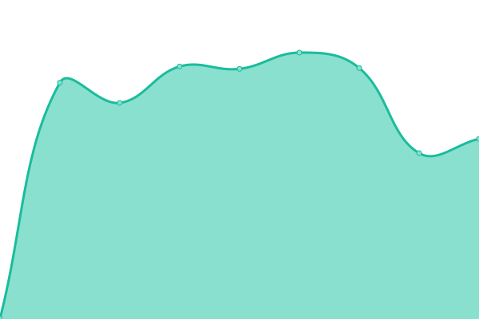

# [📈 Live Status](https://status.camph.net): <!--live status--> **🟩 All systems operational**

Upptime (https://upptime.js.org) is the open-source uptime monitor and status page, powered entirely by GitHub Actions and Issues.

<!--start: status pages-->
<!-- This summary is generated by Upptime (https://github.com/upptime/upptime) -->
<!-- Do not edit this manually, your changes will be overwritten -->

| URL                                                                                                  | Status | History                                                                                                  | Response Time                                                                          | Uptime                                                                                                                                                                                                                   |
| ---------------------------------------------------------------------------------------------------- | ------ | -------------------------------------------------------------------------------------------------------- | -------------------------------------------------------------------------------------- | ------------------------------------------------------------------------------------------------------------------------------------------------------------------------------------------------------------------------ |
| [Website](https://camph.net)                                                                         | 🟩 Up  | [website.yml](https://github.com/camphor-/status/commits/master/history/website.yml)                     |  881ms           |                      |
| [Books](https://books.camph.net)                                                                     | 🟩 Up  | [books.yml](https://github.com/camphor-/status/commits/master/history/books.yml)                         |  575ms             |                          |
| [Account](https://account.camph.net)                                                                 | 🟩 Up  | [account.yml](https://github.com/camphor-/status/commits/master/history/account.yml)                     |  567ms           |                      |
| [Advent](https://advent.camph.net)                                                                   | 🟩 Up  | [advent.yml](https://github.com/camphor-/status/commits/master/history/advent.yml)                       |  998ms            |                        |
| [Blog](https://blog.camph.net)                                                                       | 🟩 Up  | [blog.yml](https://github.com/camphor-/status/commits/master/history/blog.yml)                           |  1434ms             |                            |
| [TechBlog](https://tech.camph.net)                                                                   | 🟩 Up  | [tech-blog.yml](https://github.com/camphor-/status/commits/master/history/tech-blog.yml)                 |  1263ms        |                  |
| [Calendar](https://cal.camph.net)                                                                    | 🟩 Up  | [calendar.yml](https://github.com/camphor-/status/commits/master/history/calendar.yml)                   |  556ms          |                    |
| [Feeds](https://feeds.camph.net/public/feeds.json)                                                   | 🟩 Up  | [feeds.yml](https://github.com/camphor-/status/commits/master/history/feeds.yml)                         |  833ms             |                          |
| [House](https://house.camph.net)                                                                     | 🟩 Up  | [house.yml](https://github.com/camphor-/status/commits/master/history/house.yml)                         |  561ms             |                         |
| [IPSJ](http://ipsj.camph.net/)                                                                       | 🟩 Up  | [ipsj.yml](https://github.com/camphor-/status/commits/master/history/ipsj.yml)                           |  734ms              |                            |
| [Jinrou](http://jinrou.camph.net)                                                                    | 🟩 Up  | [jinrou.yml](https://github.com/camphor-/status/commits/master/history/jinrou.yml)                       |  708ms            |                        |
| [Python Tutorial](http://python-tutorial.camph.net)                                                  | 🟩 Up  | [python-tutorial.yml](https://github.com/camphor-/status/commits/master/history/python-tutorial.yml)     |  1266ms  |      |
| [Relaym API Prod](https://relaym-api.camph.net/api/v3/sessions/06b7db29-b1d7-4ae7-bfdf-ddaf0f4274c3) | 🟩 Up  | [relaym-api-prod.yml](https://github.com/camphor-/status/commits/master/history/relaym-api-prod.yml)     |  692ms   |      |
| Registry (Internal)                                                                                  | 🟩 Up  | [registry-internal.yml](https://github.com/camphor-/status/commits/master/history/registry-internal.yml) |  472ms |  |

<!--end: status pages-->

## For Admin

https://camphor.esa.io/posts/195

## ⭐ How it works

- GitHub Actions is used as an uptime monitor
  - Every 5 minutes, a workflow visits your website to make sure it's up
  - Response time is recorded every 6 hours and committed to git
  - Graphs of response time are generated every day
- GitHub Issues are used for incident reports
  - An issue is opened if an endpoint is down
  - People from your team are assigned to the issue
  - Incidents reports are posted as issue comments
  - Issues are locked so non-members cannot comment on them
  - Issues are closed automatically when your site comes back up
  - Slack notifications are sent on updates
- GitHub Pages are used for the status website
  - A simple, beautiful, and accessible PWA is generated
  - Built with Svelte and Sapper
  - Fetches data from this repository using the GitHub API

## 💝 Who's using Upptime

<!-- start: readme-repos-list -->
<!-- This list is auto-generated using koj-co/readme-repos-list -->
<!-- Do not edit this list manually, your changes will be overwritten -->

<!-- end: readme-repos-list -->

## 👩‍💻 [Documentation](https://upptime.js.org)

1. [How it works](https://upptime.js.org/docs)
1. [Getting started](https://upptime.js.org/docs/get-started)
1. [Configuration](https://upptime.js.org/docs/configuration)
1. [Triggers](https://upptime.js.org/docs/triggers)
1. [Notifications](https://upptime.js.org/docs/notifications)
1. [Badges](https://upptime.js.org/docs/badges)
1. [Packages](https://upptime.js.org/docs/packages)
1. [Contributing](https://upptime.js.org/docs/contributing)
1. [Frequently Asked Questions](https://upptime.js.org/docs/faq)

### Concepts

#### Issues as incidents

When the GitHub Actions workflow detects that one of your URLs is down, it automatically opens a GitHub issue ([example issue #15](https://github.com/koj-co/upptime/issues/15)). You can add incident reports to this issue by adding comments. When your site comes back up, the issue will be closed automatically as well.

<table>
  <tr>
    <td>
      
    </td>
    <td>
      
    </td>
  </tr>
</table>

#### Commits for response time

Four times per day, another workflow runs and records the response time of your websites. This data is commited to GitHub, so it's available in the commit history of each file ([example commit history](https://github.com/koj-co/upptime/commits/master/history/wikipedia.yml)). Then, the GitHub API is used to graph the response time history of each endpoint and to track when a site went down.

<table>
  <tr>
    <td>
      
    </td>
    <td>
      
    </td>
  </tr>
</table>
<!--end: docs-->

## 📄 License

- Code: [MIT](./LICENSE) © [CAMPHOR-](https://camph.net/)
- Data in the `./history` directory: [Open Database License](https://opendatacommons.org/licenses/odbl/1-0/)
